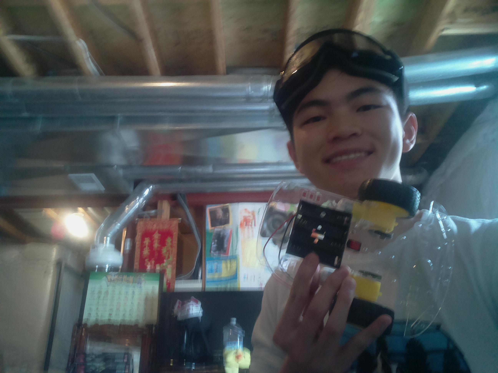

# BSE Human-Directed Rolling Machine
Replace this text with a brief description (2-3 sentences) of your project. This description should draw the reader in and make them interested in what you've built. You can include what the biggest challenges, takeaways, and triumphs from completing the project were. As you complete your portfolio, remember your audience is less familiar than you are with all that your project entails!

You should comment out all portions of your portfolio that you have not completed yet, as well as any instructions:
```HTML 
<!--- This is an HTML comment in Markdown -->
<!--- Anything between these symbols will not render on the published site -->
```

| **Engineer** | **School** | **Area of Interest** | **Grade** |
|:--:|:--:|:--:|:--:|
| Wynton Z | Eaglecrest HS | Aerospace Engineering | Incoming Senior

**Replace the BlueStamp logo below with an image of yourself and your completed project. Follow the guide [here](https://tomcam.github.io/least-github-pages/adding-images-github-pages-site.html) if you need help.**


  
# Milestone, Final

**Don't forget to replace the text below with the embedding for your milestone video. Go to Youtube, click Share -> Embed, and copy and paste the code to replace what's below.**

<iframe width="560" height="315" src="https://www.youtube.com/embed/F7M7imOVGug" title="YouTube video player" frameborder="0" allow="accelerometer; autoplay; clipboard-write; encrypted-media; gyroscope; picture-in-picture; web-share" allowfullscreen></iframe>

For your final milestone, explain the outcome of your project. Key details to include are:
- What you've accomplished since your previous milestone
- What your biggest challenges and triumphs were at BSE
- A summary of key topics you learned about
- What you hope to learn in the future after everything you've learned at BSE


# Milestone, 2

**Don't forget to replace the text below with the embedding for your milestone video. Go to Youtube, click Share -> Embed, and copy and paste the code to replace what's below.**

<iframe width="560" height="315" src="https://www.youtube.com/embed/y3VAmNlER5Y" title="YouTube video player" frameborder="0" allow="accelerometer; autoplay; clipboard-write; encrypted-media; gyroscope; picture-in-picture; web-share" allowfullscreen></iframe>

For your second milestone, explain what you've worked on since your previous milestone. You can highlight:
- Technical details of what you've accomplished and how they contribute to the final goal
- What has been surprising about the project so far
- Previous challenges you faced that you overcame
- What needs to be completed before your final milestone 

# Milestone, 1

**First Milestone video recorded**

<iframe width="560" height="315" src="https://www.youtube.com/embed/CaCazFBhYKs" title="YouTube video player" frameborder="0" allow="accelerometer; autoplay; clipboard-write; encrypted-media; gyroscope; picture-in-picture; web-share" allowfullscreen></iframe>

Hello everyone! This is my first milestone and this is what I've done so far:
-Programming
  -Hardware: Assembled Raspberry Pi computer, attached onboard camera
  -Testing: Recorded a video and took my first photo (unexpectedly)
  -Platform: Downloaded Python 2 and ran testing scripts
-Vehicle
  -Chasis: Wheels, motors, motor controllers, battery holder, and power switch assembled together

# Schematics 
Here's where you'll put images of your schematics. [Tinkercad](https://www.tinkercad.com/blog/official-guide-to-tinkercad-circuits) and [Fritzing](https://fritzing.org/learning/) are both great resoruces to create professional schematic diagrams, though BSE recommends Tinkercad because it can be done easily and for free in the browser. 

# Code
Here's where you'll put your code. The syntax below places it into a block of code. Follow the guide [here]([url](https://www.markdownguide.org/extended-syntax/)) to learn how to customize it to your project needs. 

```c++
void setup() {
  // put your setup code here, to run once:
  Serial.begin(9600);
  Serial.println("Hello World!");
}

void loop() {
  // put your main code here, to run repeatedly:

}
```

# Bill of Materials

| **Part** | **Note** | **Price** | **Link** |
|:--:|:--:|:--:|:--:|
| Raspberry Pi | Onboard computer, the "brains" of the robot | 35$ | <a href="https://www.raspberrypi.com/products/raspberry-pi-4-model-b/"> Link </a> |
| LS9110 Dual-Channel Motor Controller | Speed and directional wheel director | 1$ | <a href="https://www.elecrow.com/l9110-dualchannel-hbridge-motor-driver-module-12v-800ma-p-826.html"> Link </a> |
| HC-SR04 Ultrasonic Sensors | Proximity localization |  | <a href="https://www.amazon.com/HiLetgo-HC-SR04-Ultrasonic-Distance-MEGA2560/dp/B00E87VXH0/ref=sr_1_6?keywords=hc-sr04&s=industrial&sr=1-6"> Link </a> |
| Assorted Jumper Wires | Power supply management and overall connections | 7$ | <a href="https://www.amazon.com/EDGELEC-Breadboard-Optional-Assorted-Multicolored/dp/B07GD2BWPY/ref=sr_1_1_sspa?keywords=jumper+wires&s=industrial&sr=1-1-spons&sp_csd=d2lkZ2V0TmFtZT1zcF9hdGY&psc=1"> Link </a> |
| Raspberry Pi camera | Image recognition | 10$ | <a href="https://www.amazon.com/Arducam-Megapixels-Sensor-OV5647-Raspberry/dp/B012V1HEP4/ref=sr_1_3?keywords=raspberry+pi+camera&sr=8-3"> Link </a> |
| Breadboards | Used in conjunction with jumper wires, breadboards are used to streamline power supplication and connections | $Price | <a href="https://www.amazon.com/Breadboards-Solderless-Breadboard-Distribution-Connecting/dp/B07DL13RZH/ref=sr_1_5?keywords=breadboards&sr=8-5"> Link </a> |
| Smart Car Kit | Chasis, wheels, and overall body of the project | 14$ | <a href="https://www.amazon.com/Smart-Chassis-Motors-Encoder-Battery/dp/B01LXY7CM3/ref=sr_1_2?keywords=smart+car+chassis&sr=8-2"> Link </a> |
| Power Bank | Redundant and secondary power source  | 17$| <a href="https://www.amazon.com/EnergyQC-Portable-Ultra-Compact-Compatible-More-Black/dp/B09Z6T7FQ8/ref=sr_1_5?keywords=energy+qc&sr=8-5"> Link </a> |

# Other Resources/Examples
One of the best parts about Github is that you can view how other people set up their own work. Here are some past BSE portfolios that are awesome examples. You can view how they set up their portfolio, and you can view their index.md files to understand how they implemented different portfolio components.
- [Example 1](https://projects.bluestampengineering.com/student-projects/winston-l/)
- [Example 2](https://komeed.github.io/Omeed-BSE-Portfolio/)
- [Example 3](https://arneshkumar.github.io/arneshbluestamp/)

To watch the BSE tutorial on how to create a portfolio, click here.
